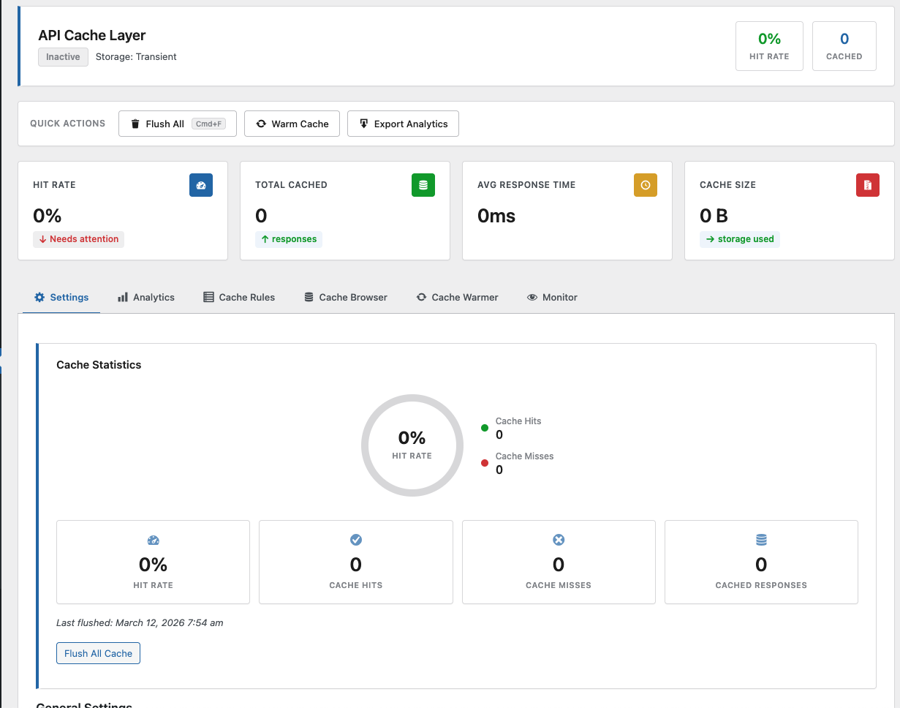
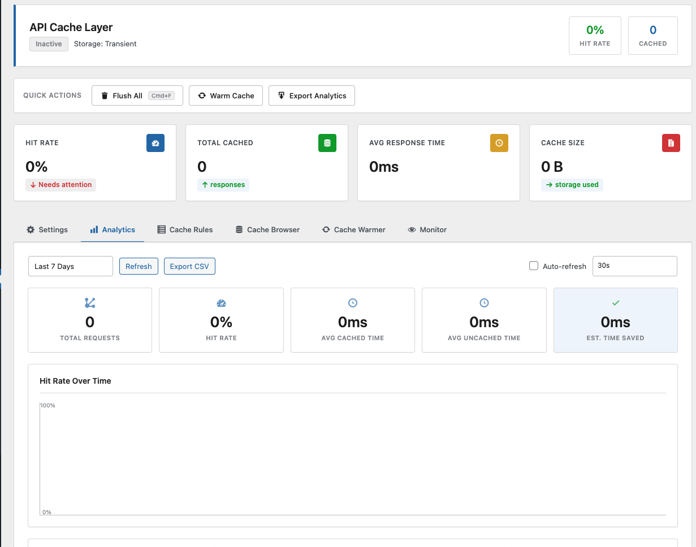
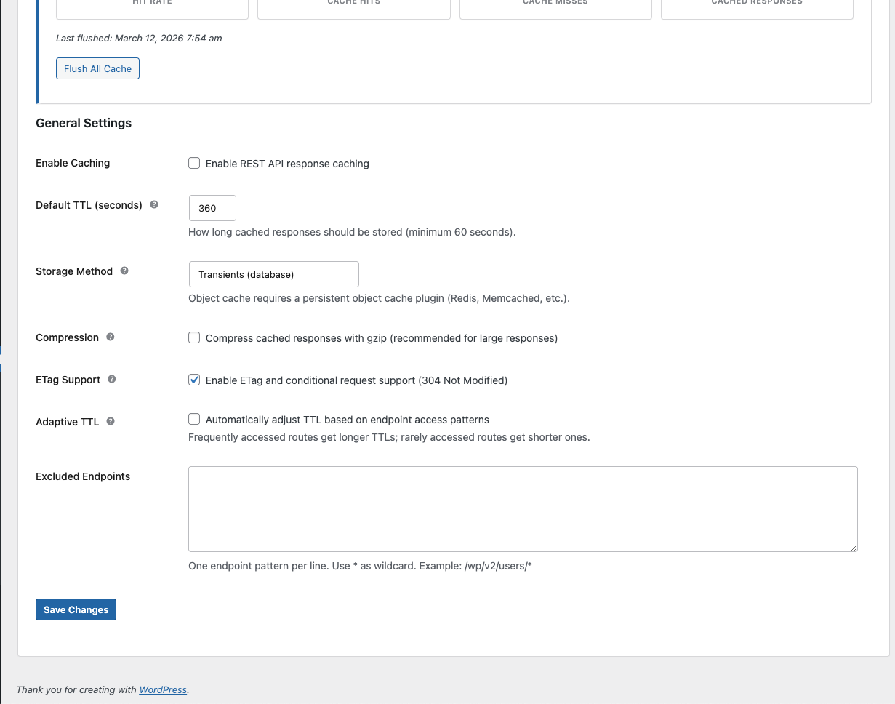
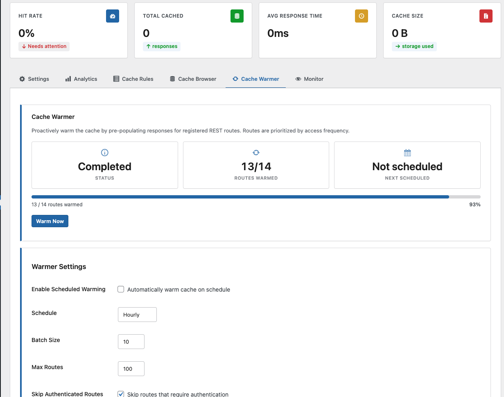
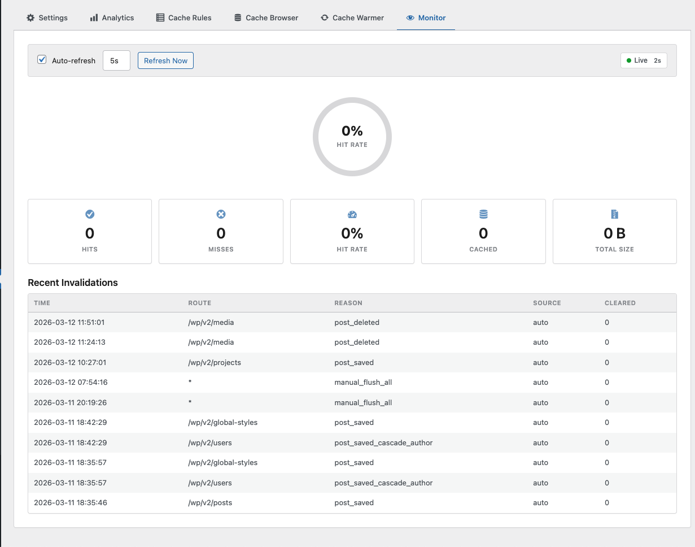

# API Cache Layer

Transparent caching layer for WordPress REST API responses. Caches GET requests using transients or an external object cache backend (Redis, Memcached), with configurable TTL, per-route rules, automatic invalidation on content changes, cache warming, analytics, and deploy detection.

## Features

- Cache REST API GET responses with configurable TTL (default: 3600s)
- Storage via WordPress transients or external object cache (Redis, Memcached)
- Per-route cache rules with wildcard pattern matching and priority ordering
- Cache key variation by query parameters, user role, or custom headers
- Stale-while-revalidate support with background refresh
- Cache tagging and tag-based invalidation
- Automatic cache invalidation on post, term, comment, user, and option changes
- Cascade invalidation across related endpoints (e.g., updating a post also invalidates its taxonomy and author endpoints)
- ETag support with HTTP 304 responses
- Gzip compression for cached responses larger than 1 KB
- Adaptive TTL based on per-route access frequency
- Configurable maximum cache entries with automatic eviction of oldest entries
- Cache warming via WP-Cron (hourly, twice daily, or daily) with priority based on access popularity
- Automatic cache warm-up after flush
- Deploy detection: flushes cache and schedules warm-up on plugin/theme updates, theme switches, plugin activation/deactivation, and auto-updates
- CI/CD webhook endpoint for external deploy notifications
- Invalidation webhook endpoint for external cache purge triggers
- Outbound webhook notifications on cache invalidation events
- Per-endpoint analytics: hit/miss rates, response times, cache sizes
- Analytics stored in custom database tables with automatic 90-day cleanup
- Invalidation log with source tracking (auto, manual, CLI, webhook)
- Per-route rate limiting with configurable window and limit
- Admin settings page under Settings > API Cache
- Full WP-CLI support
- Response headers for debugging: `X-ACL-Cache` (HIT/MISS/STALE), `X-ACL-Cache-TTL`, `X-ACL-Cached-At`, `X-ACL-Cache-Size`, `ETag`

## Requirements

- WordPress 6.0 or later
- PHP 8.0 or later

## Installation

1. Upload the `api-cache-layer` directory to `/wp-content/plugins/`.
2. Activate through the Plugins menu in WordPress.
3. Go to **Settings > API Cache** to enable caching and configure options.

## Settings

Settings are stored under the `acl_settings` option key. Defaults:

| Setting | Default | Description |
|---|---|---|
| `enabled` | `false` | Enable or disable caching |
| `default_ttl` | `3600` | Default TTL in seconds |
| `excluded_endpoints` | (empty) | Newline-separated list of route patterns to exclude (supports `*` wildcards) |
| `storage_method` | `transient` | `transient` or `object_cache` |
| `compression` | `false` | Enable gzip compression for responses > 1 KB |
| `etag_support` | `true` | Enable ETag headers and HTTP 304 support |
| `adaptive_ttl` | `false` | Adjust TTL automatically based on access patterns |
| `max_entries` | `1000` | Maximum number of cached entries |

## Cache Rules

Cache rules allow per-route configuration. Each rule supports:

- **Route pattern** -- route to match, with `*` wildcard support (e.g., `/wp/v2/posts*`)
- **TTL** -- override the default TTL for matching routes
- **Vary by query params** -- comma-separated list of query parameters to include in the cache key
- **Vary by user role** -- generate separate cache entries per user role
- **Vary by headers** -- comma-separated list of request headers to include in the cache key
- **Skip params** -- skip caching entirely when these query parameters are present
- **Stale TTL** -- serve stale data while revalidating in the background
- **Tags** -- comma-separated tags for tag-based invalidation
- **Rate limit** -- maximum requests per window for matching routes
- **Rate limit window** -- rate limit window in seconds
- **Priority** -- rule evaluation order (lower numbers match first)

Rules are managed via the admin UI, WP-CLI, or programmatically through the `Cache_Rules` class.

## WP-CLI Commands

All commands are registered under the `wp acl` namespace.

### Flush cache

```
wp acl flush
wp acl flush --route=/wp/v2/posts
wp acl flush --tag=posts
```

Flush all cached responses, or filter by route pattern or cache tag.

### Warm cache

```
wp acl warm
wp acl warm --routes=/wp/v2/posts,/wp/v2/pages
wp acl warm --batch-size=20
wp acl warm --dry-run
```

Pre-populate the cache by dispatching internal GET requests to registered REST routes. Routes are sorted by access popularity. Use `--dry-run` to preview which routes would be warmed.

### View statistics

```
wp acl stats
wp acl stats --format=json
```

Display cache hit rate, total hits/misses, number of cached entries, storage backend, warmer state, and next scheduled warm time.

### View analytics

```
wp acl analytics
wp acl analytics --period=30d
wp acl analytics --period=7d --top=20
wp acl analytics --format=json
```

Show analytics summary for a time period (1d, 7d, 30d, 90d), including top cached endpoints, top missed endpoints, and response time comparisons (cached vs. uncached).

### List cached entries

```
wp acl list
wp acl list --route=/wp/v2/posts
wp acl list --format=json
```

Show all cached entries with their route, status, size, cached time, and remaining TTL.

### View invalidation log

```
wp acl log
wp acl log --limit=50
wp acl log --format=json
```

Display recent invalidation events with route, reason, source, entries cleared, and timestamp.

### Manage cache rules

```
wp acl rules list
wp acl rules add --route="/wp/v2/posts*" --ttl=7200
wp acl rules add --route="/wp/v2/pages*" --ttl=3600 --tags=pages --priority=5
wp acl rules delete --id=abc123
```

List, add, or delete cache rules from the command line.

## Hooks and Filters

### Filters

**`acl_should_cache`** `(bool $should_cache, WP_REST_Request $request)`
Control whether a specific request should be cached. Return `false` to skip caching.

**`acl_cache_ttl`** `(int $ttl, string $route)`
Modify the TTL for a specific route. The rules engine hooks into this at priority 20.

**`acl_cache_key_parts`** `(array $parts, WP_REST_Request $request)`
Modify the components used to generate the cache key. Add entries to vary the cache by custom dimensions (e.g., language, currency).

**`acl_cache_authenticated`** `(bool $cache, WP_REST_Request $request)`
By default, authenticated (logged-in) requests are never cached. Return `true` to allow caching for a specific authenticated request.

**`acl_tracked_options`** `(array $option_names)`
Modify the list of WordPress options that trigger a full cache flush when updated. Defaults: `permalink_structure`, `blogname`, `blogdescription`, `posts_per_page`, `default_category`.

### Actions

**`acl_cache_flushed`**
Fires after all cache entries have been flushed.

**`acl_post_cache_invalidated`** `(WP_Post $post, string $rest_base, Cache_Manager $cache_manager)`
Fires after a post's related cache entries are invalidated.

**`acl_deploy_detected`** `(string $type, string $details)`
Fires after a deploy event is processed. Types: `plugin_update`, `theme_update`, `theme_switch`, `plugin_activate`, `plugin_deactivate`, `ci_webhook`, `manual`.

## REST API Endpoints

**`POST /acl/v1/invalidate`**
Invalidate cache entries by route pattern. Requires the `X-ACL-Webhook-Secret` header. Send `{"route": "/wp/v2/posts", "reason": "deploy"}` or `{"route": "*"}` to flush everything.

**`POST /acl/v1/deploy-notify`**
CI/CD deploy webhook. Flushes the entire cache and schedules a warm-up. Requires the `X-ACL-Secret` header.

## Debug Headers

Every REST API response includes cache status headers when caching is enabled:

| Header | Values | Description |
|---|---|---|
| `X-ACL-Cache` | `HIT`, `MISS`, `STALE` | Whether the response was served from cache |
| `X-ACL-Cache-TTL` | seconds | TTL assigned to the cached entry (on MISS) |
| `X-ACL-Cached-At` | Unix timestamp | When the entry was originally cached (on HIT) |
| `X-ACL-Cache-Size` | bytes | Size of the cached data (on HIT) |
| `ETag` | hash | Content hash for conditional requests |

## Screenshots


*Settings page with cache statistics, hit/miss counters, and general configuration*


*Analytics dashboard with hit rate chart, request totals, and time saved metrics*


*General settings with TTL, storage method, compression, ETag, and adaptive TTL*


*Cache warmer with route warming progress, schedule, and batch configuration*


*Real-time monitor with auto-refresh, invalidation log, and live cache status*

## Changelog

### 3.0.0
- Refactored to PSR-4 autoloading with namespaced classes
- Added centralized AJAX handler for admin operations
- Added admin settings page with full UI

### 2.1.0
- Added deploy detection (plugin/theme updates, theme switches, auto-updates)
- Added CI/CD deploy webhook endpoint (`/acl/v1/deploy-notify`)
- Automatic cache flush and warm-up on deploy events

### 2.0.0
- Added per-route cache rules with wildcard matching
- Added cache key variation (query params, user roles, headers)
- Added stale-while-revalidate support
- Added cache tagging and tag-based invalidation
- Added per-route rate limiting
- Added cache warming via WP-Cron with popularity-based priority
- Added per-endpoint analytics with custom database tables
- Added invalidation logging
- Added adaptive TTL based on access patterns
- Added ETag and HTTP 304 support
- Added gzip compression
- Added cascade invalidation for related endpoints
- Added webhook support (inbound invalidation, outbound notifications)
- Added WP-CLI commands
- Added deferred/batched database writes for reduced per-request overhead
- Automatic invalidation on post, term, comment, user, and option changes

### 1.0.0
- Initial release with basic REST API response caching
- Transient and object cache backend support
- Configurable TTL and endpoint exclusions
- Cache statistics tracking

## License

GPL-2.0-or-later
